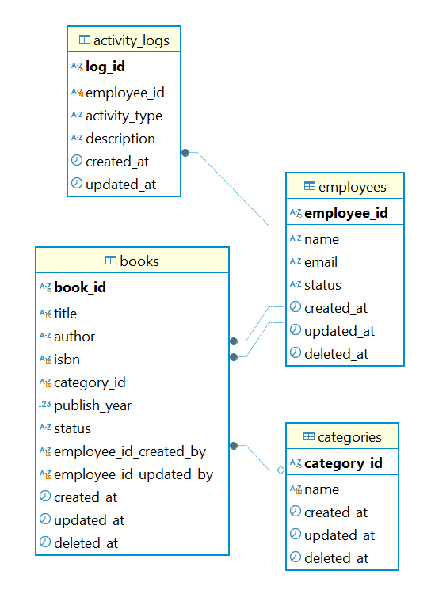
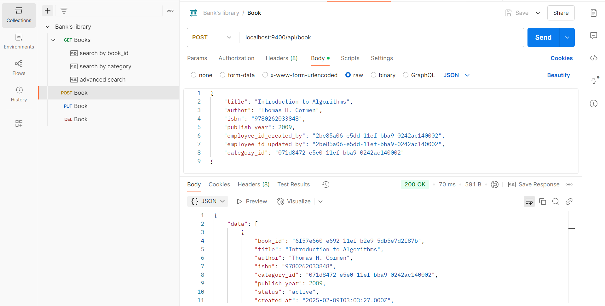

# Bank's library system

This repository is about backend service for an interview test using NodeJS.

## Database Design

`The ER diagram image` captured from DBeaver program.



## Prerequisite

- Available TCP ports: 3306 and 9400.
- Bash
- Docker compose
- Postman

## Installation

Add .env file for a backend application.

```bash
cp ./backend/.env-sample ./backend/.env
```

Launch the backend and database service.

```bash
cd deployment
docker compose up -d
```

Import this postman collection file

`documents/postman_collection.json`

## Usage

Call APIs using Postman, including:
- GET book (with examples)
- POST book
- PUT book
- DELETE book

